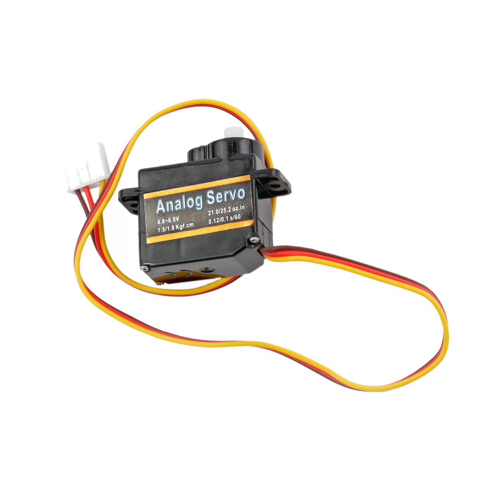

# Servomotor

## Beschreibung
Ein Servomotor verfügt über eine interne Regelung, sodass von außen nur eine Position angeben werden muss, die er selbstständig anfährt und hält (trotz Krafteinwirkung). Er kann dadurch sehr genaue Positionen anfahren, ist aber nicht für endloses Drehen ausgelegt. Der Motor wird direkt oder mit Hilfe des Grove Shields an einen Arduino angeschlossen und über Pulsweitenmodulation (PWM) angesteuert.

Der hier abgebildete Servomotor kann in einem begrenzten Winkelbereich rotieren und somit unter anderem Zeiger oder Hebel bewegen. So kann beispielsweise die Lenkung eines ferngesteuerten Autos mithilfe von Servomotoren bewegt werden.

Alle weiteren Hintergrundinformationen, sowie ein Beispielaufbau und alle notwendigen Programmbibliotheken sind auf dem offiziellen Wiki (bisher nur in englischer Sprache) von Seeed Studio zusammengefasst. Zusätzlich findet man über alle gängigen Suchmaschinen durch die Eingabe der genauen Komponentenbezeichnungen entsprechende Projektbeispiele und Tutorials.

**Wichtige Hinweise:**

Je nach Motoraufbau kann der maximale Aktionsradius des Motors variieren. In vielen Fällen erreicht der Motor nicht die angegebene Gesamtrotation von 180°. Ist dies der Fall, kann es zu unerwartetem Verhalten (Zucken, Rattern, Spannungsabfall, Wärmeentwicklung…) führen, wenn der Motor in die Extrempositionen gedreht wird. Aus diesem Grund wird empfohlen, den Motor nur in einem Bereich von ca. 10° bis 170° zu bewegen.

## Beispiele

!!!show-examples:./examples/

<!-- infolist -->

 

@[youtube](https://www.youtube.com/watch?v=wVxcmO2YuxA)

 

## Wichtige Links für die ersten Schritte:

- [Seeed Studio Wiki](http://wiki.seeedstudio.com/Grove-Servo/) [- Servomotor](http://wiki.seeedstudio.com/Grove-Servo/)

## Projektbeispiele:

- [Makerblog - Farberkennung mit Servomotoranzeige](https://www.makerblog.at/2015/01/farben-erkennen-mit-dem-rgb-sensor-tcs34725-und-dem-arduino/)
- [Arduino Tutorial - Servo](https://www.arduino-tutorial.de/servo/)

## Weiterführende Hintergrundinformationen:

- [Pulsweitenmodulation - Wikipedia Artikel](https://de.wikipedia.org/wiki/Pulsweitenmodulation)
- [GPIO - Wikipedia Artikel](https://de.wikipedia.org/wiki/Allzweckeingabe/-ausgabe)
- [Servomotor - Wikipedia Artikel](https://de.wikipedia.org/wiki/Servomotor)

